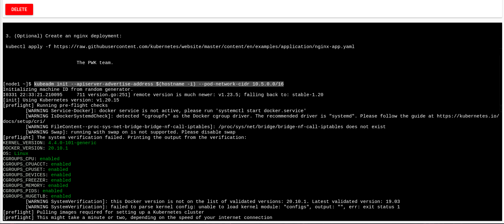
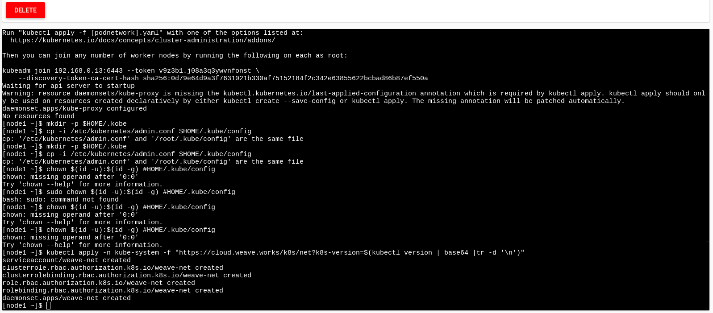
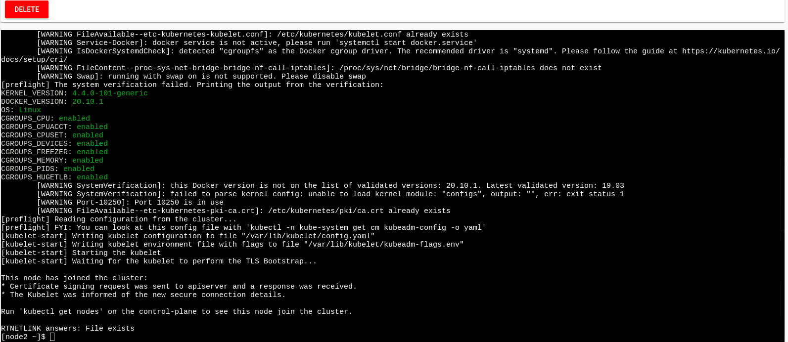
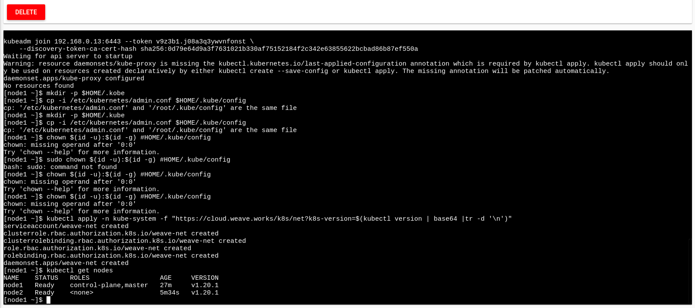
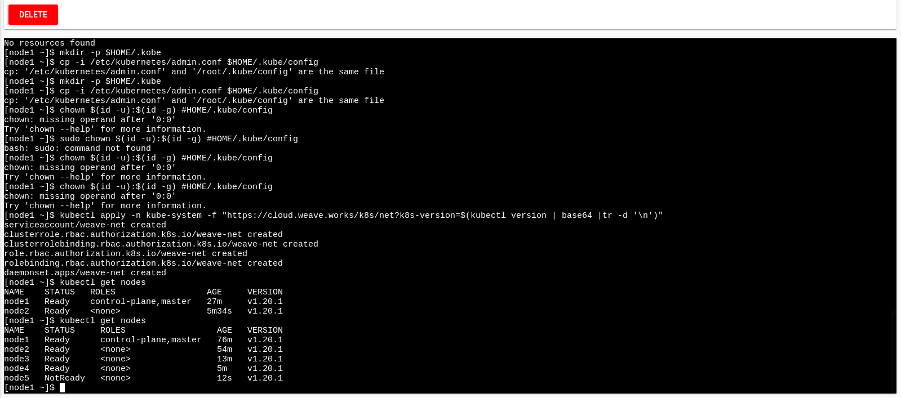
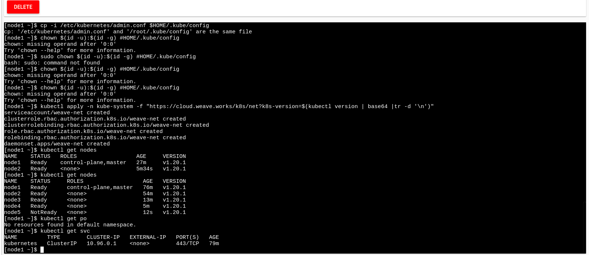
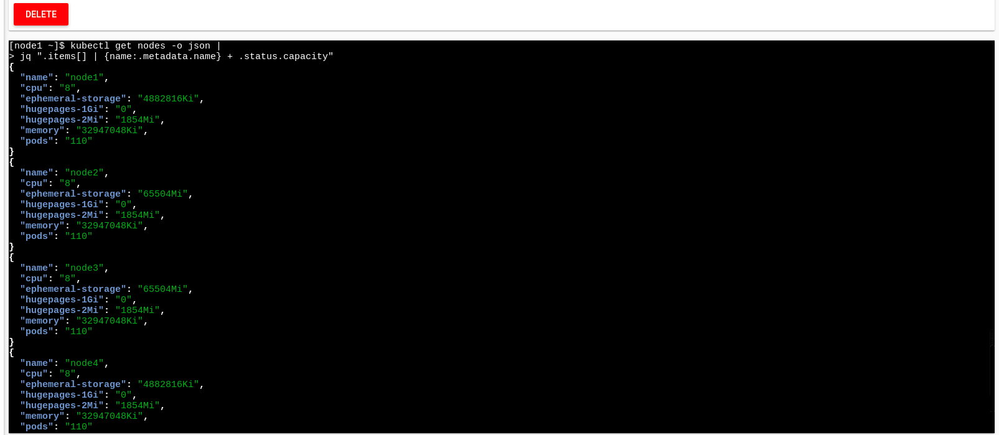
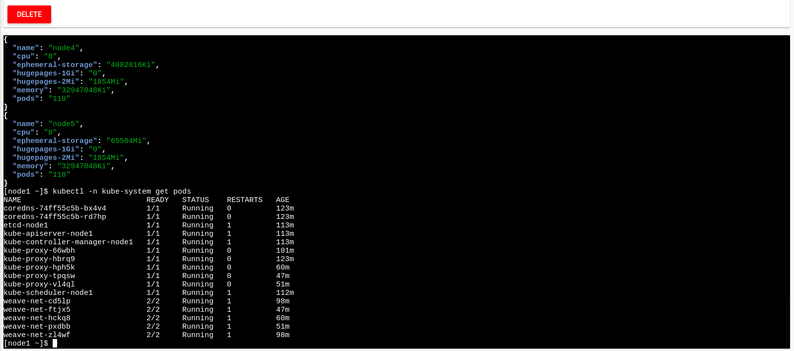
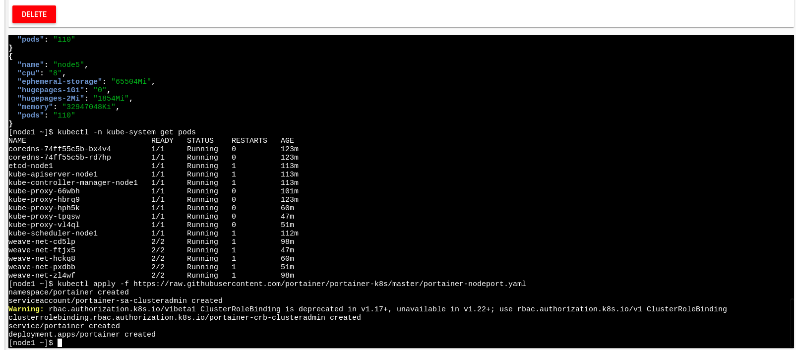
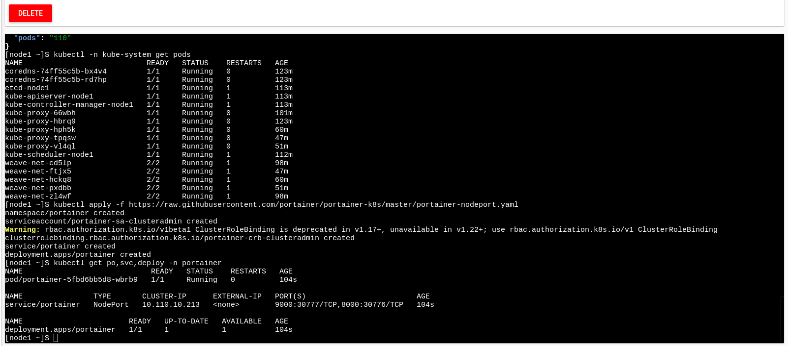

<span style="color: green"> # Preparing 5-Node Kubernetes Cluster </span>

## Student: Brayan Aliux Reyes Martinez

# Introduction 

Kubernetes is a portable and extensible open source platform for managing workloads and services, it facilitates automation and declarative configuration and has a large and rapidly growing ecosystem. Within this article we will create a Kubernetes environment with 5 nodes deployed on several open source instances which Kubernetes will use as a working machine. 
In this practice we will use Play with Kubernetes which allows users to run K8 clusters in a matter of seconds. It is worth mentioning that each node is managed by the master component and contains the necessary services to run the pods.


# General Objective 

Develop and implement container management and visualization tools in Kubernetes in the IaaS model. 

## Specific Objectives 
- Use online tools such as Kubernetes Playground. 
- Identify the nodes created with the Kubernetes container.


## Processing steps for preparing 5-Node Kubernetes Cluster
To get started with Kubernetes, follow the below steps:

- Open https://play-with-k8s.com on your browser

Click on Add Instances to setup first k8s node cluster

## Run the below command:

```
kubeadm init --apiserver-advertise-address $(hostname -i)
mkdir -p $HOME/.kube
chown $(id -u):$(id -g) $HOME/.kube/config
kubectl apply -n kube-system -f \
    "https://cloud.weave.works/k8s/net?k8s-version=$(kubectl version | base64 |tr -d '\n')"
```
## Results 'kubeadm init' 
This command initializes a Kubernetes control-plane node.

The IP address the API Server will advertise it's listening on. If not set the default network interface will be used.
## Results 'kubectl apply'
kubectl apply manages applications through files defining Kubernetes resources. It creates and updates resources in a cluster through running kubectl apply. This is the recommended way of managing Kubernetes applications on production

## Adding New K8s Cluster Node

Click on ```Add Instances``` to setup first k8s node cluster

Wait for 1 minute time till it gets completed.

Copy the command starting with ```kubeadm join .....``` We will need it to be run on the worker node.

## Setting up Worker Node

Click on ```Add New Instance``` and paste the last ```kubeadm``` command on this fresh new worker node.

```
[node2 ~]$ kubeadm join --token 4f924f.14eb7618a20d2ece 192.168.0.8:6443 --discovery-token-ca-cert-hash  sha256:a5c25aa4573e06a0c11b11df23c8f85c95bae36cbb07d5e7879d9341a3ec67b
```
## Results kubeadm join
This command initializes a Kubernetes worker node and joins it to the cluster.

You will see the below output:
```
[kubeadm] WARNING: kubeadm is in beta, please do not use it for production clusters.
[preflight] Skipping pre-flight checks[discovery] Trying to connect to API Server "192.168.0.8:6443"
[discovery] Created cluster-info discovery client, requesting info from "https://192.168.0.8:6443"
[discovery] Requesting info from "https://192.168.0.8:6443" again to validate TLS against the pinned public key
[discovery] Cluster info signature and contents are valid and TLS certificate validates against pinned roots, will use API Server "192.168.0.8:6443"[discovery] Successfully established connection with API Server "192.168.0.8:6443"
[bootstrap] Detected server version: v1.8.15
[bootstrap] The server supports the Certificates API (certificates.k8s.io/v1beta1)
Node join complete:
* Certificate signing request sent to master and response
  received.
* Kubelet informed of new secure connection details.
Run 'kubectl get nodes' on the master to see this machine join.
[node2 ~]$
```
## Verifying Kubernetes Cluster
Run the below command on master node
```
[node1 ~]$ kubectl get nodes
NAME      STATUS    ROLES     AGE       VERSION
node1     Ready     master    15m       v1.10.2
node2     Ready     <none>    1m        v1.10.2
[node1 ~]$
```
## Results Verifying Kubernetes Cluste

We note that 2 nodes have been created, a master and a slave node.
## Adding Worker Nodes
```
[node1 ~]$ kubectl get nodes
NAME      STATUS    ROLES     AGE       VERSION
node1     Ready     master    58m       v1.10.2
node2     Ready     <none>    57m       v1.10.2
node3     Ready     <none>    57m       v1.10.2
node4     Ready     <none>    57m       v1.10.2
node5     Ready     <none>    54s       v1.10.2
```
## Results Adding Worker Nodes

We validate the following action of the created nodes and verify that they are ready to work.
```
[node1 istio]$ kubectl get po
No resources found.
```
We verify that obviously we do not have any Pods in execution state.
```
[node1 ]$ kubectl get svc
NAME         TYPE        CLUSTER-IP   EXTERNAL-IP   PORT(S)   AGE
kubernetes   ClusterIP   10.96.0.1    <none>        443/TCP   1h
[node1] $
```
## Results Worker Nodes

We verify that the service really exists and obtain the cluster information
## Show the capacity of all our nodes as a stream of JSON objects
```
kubectl get nodes -o json |
      jq ".items[] | {name:.metadata.name} + .status.capacity"
```
## Results Show the capacity
We show the running nodes in detail, where relevant information such as name and capacity status will be shown, everything will be seen in the ".JSON" file.


## Accessing namespaces
By default, ```kubectl``` uses the default namespace. We can switch to a different namespace with the -n option

## List the pods in the kube-system namespace:
```
kubectl -n kube-system get pods
```
```
[node1 kubelabs]$ kubectl get pods -n kube-system
NAME                            READY   STATUS    RESTARTS   AGE
coredns-6dcc67dcbc-4sw6m        1/1     Running   0          2m15s
coredns-6dcc67dcbc-x4qnk        1/1     Running   0          2m15s
etcd-node1                      1/1     Running   0          108s
kube-apiserver-node1            1/1     Running   0          84s
kube-controller-manager-node1   1/1     Running   0          104s
kube-proxy-9gljr                1/1     Running   0          2m5s
kube-proxy-9zktt                1/1     Running   0          2m15s
kube-proxy-qvqrf                1/1     Running   0          107s
kube-scheduler-node1            1/1     Running   0          105s
weave-net-78bxz                 2/2     Running   0          2m15s
weave-net-g2cf6                 2/2     Running   0          2m5s
weave-net-hxqd9                 0/2     Evicted   0          19s
```

## Results List the pods 
We use the following command to display the detailed status of the deployed Kubernetes pods to run the dashboard.


## What are all these pods? 
- etcd is our etcd server
- kube-apiserver is the API server
- kube-controller-manager and kube-scheduler are other master components
- kube-dns is an additional component (not mandatory but super useful, so it’s there)
- kube-proxy is the (per-node) component managing port mappings and such
- weave is the (per-node) component managing the network overlay

The ```READY``` column indicates the number of containers in each pod. Pods with a name ending with ```-node1``` are the master components (they have been specifically “pinned” to the master node).

# Running Portainer on 5-Node Kubernetes Cluster


## Pre-requisite:

- Play with Kubernetes Platform
- Set up 5 Node Kubernetes Cluster


## Run the below command:

```
kubectl apply -f https://raw.githubusercontent.com/portainer/portainer-k8s/master/portainer-nodeport.yaml
```

## Verify

```
[node1 kubelabs]$ kubectl get po,svc,deploy -n portainer
NAME                             READY   STATUS    RESTARTS   AGE
pod/portainer-58767884bc-jqfnn   1/1     Running   2          13m
NAME                TYPE       CLUSTER-IP       EXTERNAL-IP   PORT(S)                         AGE
service/portainer   NodePort   10.111.121.188   <none>        9000:30777/TCP,8000:30776/TCP   13m
NAME                        READY   UP-TO-DATE   AVAILABLE   AGE
deployment.apps/portainer   1/1     1            1           13m
[node1 kubelabs]$
```
## Result 
Finally, using the GitHub repository, we run the ".yaml" file.
In addition to verifying obtaining the Pods, the information of what is running within the service. 


## Opening up Browser

Go to browser and add the port in the following manner:

```
https://ip172-18-0-7-bs6kb2bmjflg00fa5g4g-<ADD 30777 HERE>.direct.labs.play-with-k8s.com/
```

Results not obtained

When using an online virtualization simulator, within our browser, it was not possible to view the dashboard hosted in kubernates, because the port assigned within the containers is blocked.
It is important to verify that the specific port on the cluster IP address is open and running.


## Conclusion
Although Kubernetes already offers a lot of functionality, there are always new scenarios that benefit from new features. Application workflows can be optimized to speed up development time. This is why many companies have relied on Kubernetes to build an ecosystem of components and tools that make it easier to deploy, scale and manage applications.

We must take into account that Kubernetes is not a conventional Platform as a Service (PaaS). Since Kubernetes operates at the container level and not at the hardware level, it offers some features that PaaS also offer, such as deployments, scaling, load balancing, logging and monitoring.

As we went through this practice we noticed that we have very good control over the slave nodes which allows us to manage them in an optimal way with the master node.

## References


[1] Kubernetes, “Conceptos,” Kubernetes, Feb. 12, 2022. https://kubernetes.io/es/docs/concepts/_print/#pg-45bdca6129cf540121623e903c18ba46 (accessed Apr. 12, 2022).

[2]E. Montesdeoca del Puerto, “La importancia de Kubernetes para los desarrolladores,” Intelequia, Apr. 16, 2021. https://intelequia.com/blog/post/2120/la-importancia-de-kubernetes-para-los-desarrolladores (accessed Apr. 12, 2022).

[3] Kubernetes, “Nodos,” Kubernetes, Apr. 14, 2018. https://kubernetes.io/es/docs/concepts/architecture/nodes/ (accessed Apr. 12, 2022).

[4] Kubernetes, “kubeadm init,” Kubernetes, Oct. 06, 2021. https://kubernetes.io/docs/reference/setup-tools/kubeadm/kubeadm-init/ (accessed Apr. 12, 2022).

[5]G. Technologies, “Kubernetes: Para qué sive, Importancia y Características,” Ginzo Technologies, Jan. 26, 2022. https://ginzo.tech/blog/kubernetes-para-que-sirve/ (accessed Apr. 12, 2022).
